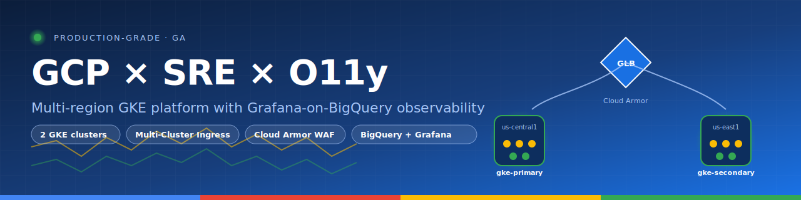
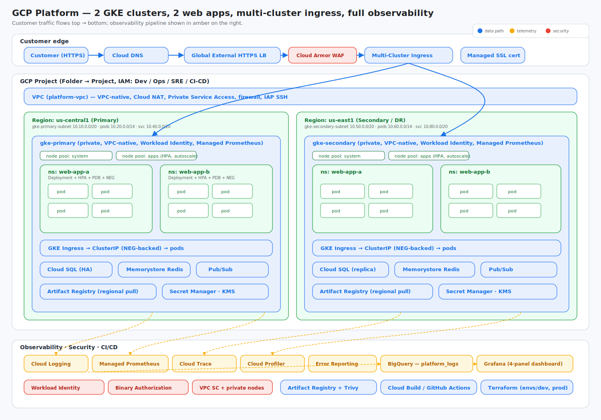

<p align="center">
  
</p>

# GCP Multi-Cluster GKE Platform with Two Web Apps and Grafana-on-BigQuery Observability

End-to-end platform on Google Cloud that runs **two stateless web applications** across **two GKE clusters in different regions**, fronted by a **global HTTPS load balancer** with **Multi-Cluster Ingress (MCI)**, with full observability (logs, metrics, traces, errors), security guardrails, and Infrastructure-as-Code.



> Diagram source: [`docs/architecture.mmd`](docs/architecture.mmd) (flow) · [`docs/traffic-flow.mmd`](docs/traffic-flow.mmd) (sequence) · [`docs/architecture-diagram.svg`](docs/architecture-diagram.svg) (the image above)

---

## 1. What this delivers

A single Terraform apply provisions a brand-new GCP project that contains:

- A platform VPC with two regional subnets (us-central1 + us-east1), Cloud NAT, Private Service Access, and baseline firewall rules.
- Two **private VPC-native GKE Standard clusters** with Workload Identity, Managed Prometheus, Shielded Nodes, Binary Authorization, and separate `system` / `apps` node pools.
- A **global external HTTPS load balancer** with a static anycast IP, Google-managed SSL cert, **Cloud Armor** WAF, and **MCI** routing traffic to the nearest healthy cluster.
- Two **stateless web applications** (`web-app-a`, `web-app-b`) deployed via Kustomize overlays to both clusters with HPAs, PDBs, topology-spread, container-native NEG load balancing, and dependency-aware readiness.
- **Observability**: Cloud Logging → BigQuery (`platform_logs`) with views feeding a **Grafana dashboard with 4 panels** (app errors, pod restarts, latency p50/p95/p99, CPU/memory). Plus Managed Prometheus, Cloud Trace, Cloud Profiler, Error Reporting, and uptime checks.
- **CI/CD**: Cloud Build *and* GitHub Actions pipelines (build → scan with Trivy → push to Artifact Registry → kustomize deploy to both clusters), authenticating via Workload Identity Federation (no JSON keys).
- **Security**: Workload Identity, Binary Authorization, Cloud Armor, Secret Manager, KMS-encrypted PD, private nodes with IAP SSH, NetworkPolicies, default-deny + explicit-allow.

---

## 2. Repository layout

```
.
├── README.md                       # ← you are here
├── docs/                           # Architecture write-up, diagrams, decisions, runbook
│   ├── ARCHITECTURE.md
│   ├── PROJECT_PLAN.md             # Timeline + effort estimate
│   ├── design-decisions.md
│   ├── runbook.md
│   ├── architecture.mmd
│   ├── traffic-flow.mmd
│   └── architecture-diagram.svg
├── terraform/                      # Infrastructure as Code
│   ├── envs/{dev,prod}/            # Environment compositions
│   └── modules/                    # project, network, iam, gke-cluster, mci,
│                                   # artifact-registry, cloud-armor, observability
├── kubernetes/                     # Kustomize manifests
│   ├── apps/{web-app-a,web-app-b}/{base,overlays/{primary,secondary}}
│   ├── ingress/                    # MCI + MCS objects
│   └── platform/                   # Namespaces, Managed Prometheus PodMonitoring
├── apps/                           # Sample app source + Dockerfiles
│   ├── web-app-a/
│   └── web-app-b/
├── observability/
│   ├── bigquery/                   # Schema notes + SQL views + sample queries
│   ├── grafana/                    # Dashboard JSON + datasource provisioning
│   └── log-sinks/
├── cicd/
│   ├── cloudbuild.yaml
│   └── github-actions/             # build-and-deploy.yml, terraform.yml
└── scripts/
    ├── bootstrap.sh                # Create TF state bucket + WIF
    ├── deploy.sh
    └── teardown.sh
```

---

## 3. End-to-end traffic flow

1. **DNS** — customer hits `https://www.yourapp.com`; Cloud DNS returns the anycast IP reserved by Terraform (`platform-edge-ip`).
2. **Global HTTPS LB** — TLS terminates at Google's edge using the managed SSL cert; **Cloud Armor** inspects with OWASP rules + adaptive L7 DDoS defense + per-IP rate limit.
3. **Multi-Cluster Ingress** — the LB's backend service is wired by MCI to **NEGs in both clusters**. Proximity routing picks the closest healthy cluster; if the closest cluster's pods fail health checks, traffic shifts to the other region with no DNS change.
4. **Cluster ingress (NEG)** — container-native load balancing reaches healthy pods directly, bypassing kube-proxy.
5. **Pod** — the chosen replica handles the request, emits structured JSON logs to stdout, Prometheus metrics on `/metrics`, and traces via OTel.
6. **Response** flows back through Service → NEG → LB → customer.
7. **Telemetry** — LB request logs, Pod logs, K8s events, and metrics fan out to Cloud Logging, Cloud Monitoring + Managed Prometheus, Cloud Trace, and Error Reporting. The logs sink exports to **BigQuery `platform_logs`** where **Grafana** queries pre-built views.

A sequence-diagram version lives at [`docs/traffic-flow.mmd`](docs/traffic-flow.mmd).

---

## 4. Quickstart

```sh
# 0) Pre-reqs: gcloud, terraform >= 1.6, kubectl, kustomize, docker, an org+billing.

# 1) One-time bootstrap (state bucket + Workload Identity Federation)
./scripts/bootstrap.sh myorg-tfstate myorg-bootstrap

# 2) Fill in env-specific values
cd terraform/envs/dev
cp terraform.tfvars.example terraform.tfvars
# edit terraform.tfvars (project_id, billing_account, hostnames, personas)

# 3) Apply
terraform init
terraform plan -out=plan.out
terraform apply plan.out

# 4) Apply Kubernetes platform resources to BOTH clusters
PROJECT=$(terraform output -raw project_id)
for CLUSTER in $(terraform output -raw primary_cluster) $(terraform output -raw secondary_cluster); do
  REGION=$([ "$CLUSTER" = "gke-primary-dev" ] && echo us-central1 || echo us-east1)
  gcloud container clusters get-credentials "$CLUSTER" --region "$REGION" --project "$PROJECT"
  kubectl apply -f kubernetes/platform/
done

# 5) Deploy the apps
./scripts/deploy.sh web-app-a v1.0.0
./scripts/deploy.sh web-app-b v1.0.0

# 6) Apply Multi-Cluster Ingress (config-cluster = primary)
gcloud container clusters get-credentials gke-primary-dev --region us-central1 --project $PROJECT
kubectl apply -f kubernetes/ingress/

# 7) Bring up the Grafana dashboard
#    - Provision the BigQuery views: bq query --use_legacy_sql=false < observability/bigquery/views.sql
#    - In Grafana, add a BigQuery datasource (observability/grafana/datasources/bigquery.yaml)
#    - Import observability/grafana/dashboards/platform-overview.json
```

---

## 5. Observability — the Grafana-on-BigQuery angle

Cloud Logging exports application + LB + node logs to a partitioned BigQuery dataset (`platform_logs`). On top of those raw tables we materialize four views (see `observability/bigquery/views.sql`):

| View                              | What it captures                       | Grafana panel                       |
|-----------------------------------|----------------------------------------|-------------------------------------|
| `v_app_errors_1m`                 | App errors per minute, per service     | Application error rate              |
| `v_pod_restarts_1h`               | Pod restarts by namespace              | Pod restarts by namespace           |
| `v_lb_latency_5m`                 | LB request latency p50 / p95 / p99     | Request latency percentiles         |
| `v_container_resources_5m`        | Avg CPU + memory per container         | Resource utilization                |

The dashboard JSON (`observability/grafana/dashboards/platform-overview.json`) is importable as-is; replace the `PROJECT` template variable with your project ID.

---

## 6. Security & resilience

- **Identity**: Workload Identity binds each KSA to a GSA; pods never carry JSON keys. CI/CD uses Workload Identity Federation from GitHub OIDC.
- **Edge**: Cloud Armor OWASP rules + adaptive protection + per-IP rate limit, applied to every backend via `BackendConfig`.
- **Cluster**: private nodes, Shielded VMs, Calico NetworkPolicies (default-deny in each namespace), Binary Authorization in **enforce** mode.
- **Data**: KMS-encrypted PD, Cloud SQL HA + PITR backups, Memorystore replicas, Pub/Sub at-least-once delivery, Artifact Registry vulnerability scanning + cleanup policies.
- **DR**: two regional clusters, MCI auto-failover on health-check loss, Terraform state versioned in GCS with soft-delete.

---

## 7. Operational diagrams

- Component view: [`docs/architecture.mmd`](docs/architecture.mmd) (Mermaid flowchart) — renders inline on GitHub/GitLab.
- Sequence view: [`docs/traffic-flow.mmd`](docs/traffic-flow.mmd) (Mermaid sequence).
- Composite SVG: [`docs/architecture-diagram.svg`](docs/architecture-diagram.svg).

---

## 8. Feasibility & timeline

**Yes — this is straightforwardly buildable.** All capabilities are GA on GCP today. A realistic delivery plan is in [`docs/PROJECT_PLAN.md`](docs/PROJECT_PLAN.md). The short version:

- **Solo engineer (familiar with GCP+GKE+Terraform): ~15–20 working days** of focused effort, end-to-end including hardening, dashboards, and runbooks.
- **2-person crew (1 platform + 1 app/observability): ~10–12 working days** of calendar time.
- **Hard floor** is set by GCP-side waits (org policy approvals, multi-cluster ingress global-LB propagation, managed-cert ACME validation) which add real-time delays even when engineering work is finished.

See `docs/PROJECT_PLAN.md` for the full breakdown.

---

## 9. Further reading

- [`docs/ARCHITECTURE.md`](docs/ARCHITECTURE.md) — long-form architecture write-up matching the original spec.
- [`docs/design-decisions.md`](docs/design-decisions.md) — what we chose and why (regional vs Autopilot, MCI vs Anthos Service Mesh, BigQuery vs Loki, etc.).
- [`docs/runbook.md`](docs/runbook.md) — common ops scenarios (failover, image rollback, DB recovery).
- [`terraform/README.md`](terraform/README.md) — module index + apply order.
